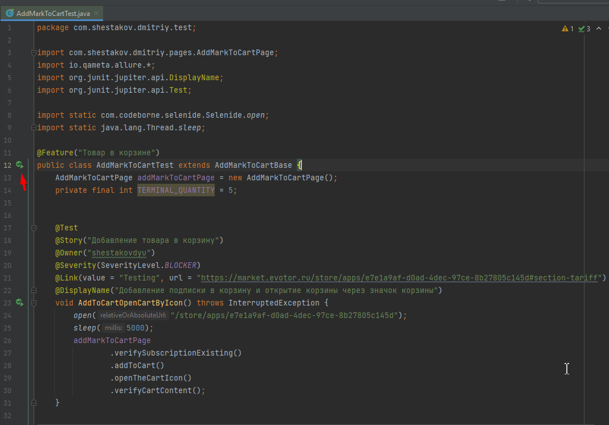
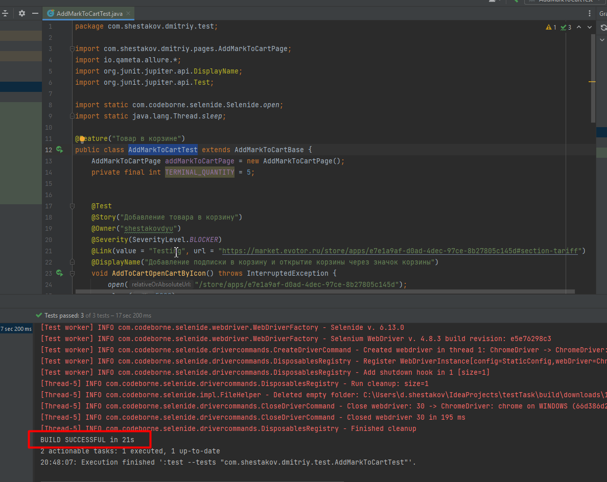
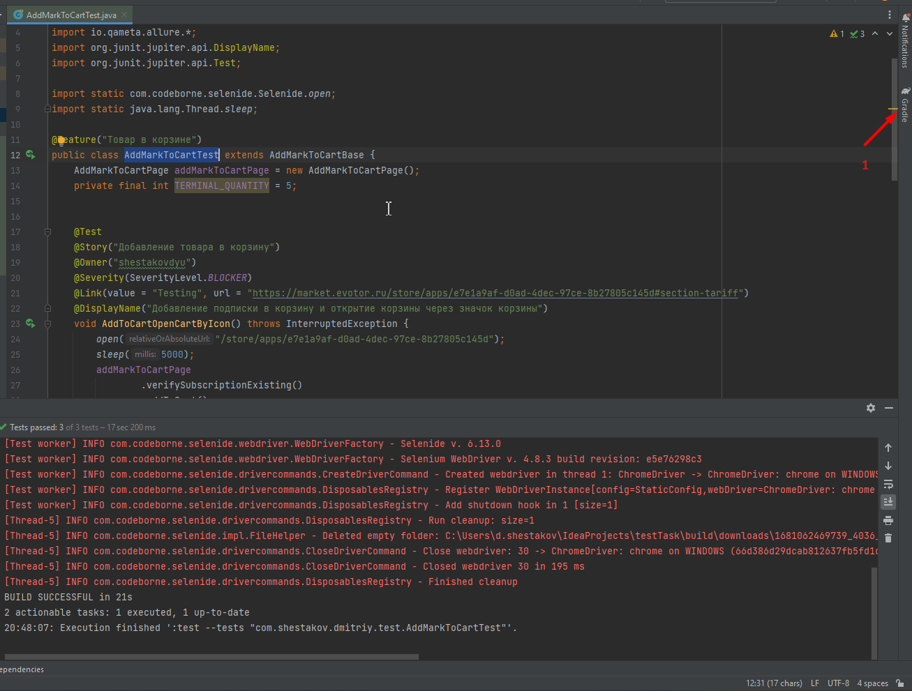
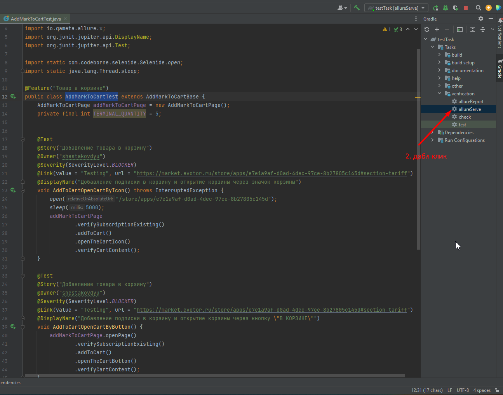

# Автотесты для [https://market.evotor.ru/](https://market.evotor.ru/store/apps/e7e1a9af-d0ad-4dec-97ce-8b27805c145d)
## Technology Stack
**Java, Gradle, Junit5, Selenide, Allure Reports.**
## Реализованы проверки:
- [X] - Добавление подписки в корзину и открытие корзины через значок корзины
- [X] - Добавление подписки в корзину и открытие корзины через кнопку "В КОРЗИНЕ"
- [X] - Добавление подписки с несколькими терминалами
## Добавлено видео о прохождении тестов

## Руководство по запуску из терминала
#### *Запуск тестов*
```bash
/gradlew clean test
```
#### *Формирование Allure отчета о тестировании*
```bash
./gradlew allureServe
```
## Ручной запуск тестов
#### *1. Открыть проект в Intellij Idea*
#### *2. Запустить класс AddMarkToCartTest*
Путь: src\test\java\com\shestakov\dmitriy\test\AddMarkToCartBase

#### *3. Дождаться окончания выполнения тестов*

#### *3. Сформировать Allure отчета о тестировании*



